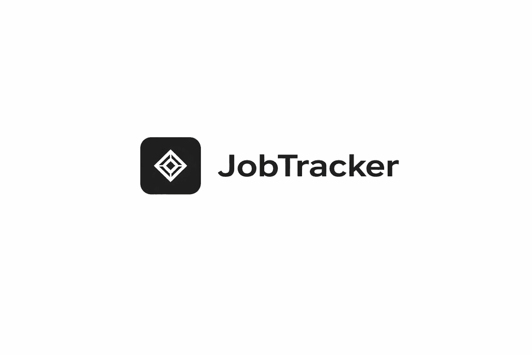

<p>
  <!-- Frontend -->
  
  
  
  <!-- Backend -->
  
  
  
  <!-- Database & Auth -->
  
  
  
  <!-- DevOps -->
  
  
</p>


**JobTracker** is a full-stack web application to manage your job search - **track applications, schedule interviews, and sync everything to Google Calendar** in one place.

## 🎯 Purpose

Built to explore and practice:

- **Google OAuth 2.0** - third-party authentication flow and token handling
- **External API integration** - communicating with Supabase and Google Calendar APIs
- **Rate limiting** - protecting APIs from abuse with per-user throttling

## ✨ Features

- **Application Tracking** - Create, update, and delete job applications with status labels: Applied, Interview, Offer, Rejected, or Ghosted
- **Interview Scheduling** - Register interviews linked to specific applications and add them to Google Calendar with a single click
- **Status Filtering** - Quickly surface applications by their current stage
- **Google OAuth** - Authenticate securely via your Google account, no password required

## 🔒 Security & Reliability

- **Rate limiting** - Per-user API rate limiting via `express-rate-limit` to protect against abuse
- **Input validation** - All incoming data is validated and sanitized using Zod schemas
- **JWT authentication** - Stateless, token-based session management

## 🚀 Getting Started

### Prerequisites

- [Docker Desktop](https://www.docker.com/products/docker-desktop) or [Node.js](https://nodejs.org)
- A [Supabase](https://supabase.com) project → [Setup guide](docs/Supabase.md)
- A [Google Cloud](https://console.cloud.google.com) OAuth 2.0 client → [Setup guide](docs/GoogleCloud.md)

### 1. Clone the repository

```bash
git clone https://github.com/RodrigoCoelhoo/job-tracker.git
cd job-tracker
```

### 2. Configure environment variables

Copy the example file and fill in your credentials:

**macOS/Linux**
```bash
cp backend/.env.example backend/.env
```
**Windows**
```cmd
copy backend\.env.example backend\.env
```

Fill in `backend/.env`:

```env
# Supabase
SUPABASE_URL=https://<project-id>.supabase.co
SUPABASE_SERVICE_ROLE_KEY=

# Google OAuth
GOOGLE_CLIENT_ID=
GOOGLE_CLIENT_SECRET=

# JWT
JWT_SECRET=your-secret-key

# App
FRONTEND_URL=http://localhost:80
BACKEND_URL=http://localhost:5000
PORT=5000
NODE_ENV=production
```

### 3. Start the application

Choose one of the following methods:

#### Local Development

> [!NOTE]
> Requires [Node.js](https://nodejs.org) to be installed.

##### Backend
```bash
cd backend
npm install
npm run dev
```

##### Frontend
```bash
cd frontend
npm install
npm run dev
```

#### Docker

> [!NOTE]
> Requires [Docker Desktop](https://www.docker.com/products/docker-desktop) to be installed.

```bash
docker-compose up --build
```

---

| Service  | URL                   |
|----------|-----------------------|
| Frontend | http://localhost:80   |
| Backend  | http://localhost:5000 |


## 📡 API Reference

### Auth

| Method | Endpoint        | Description              |
|--------|-----------------|--------------------------|
| GET    | /auth/google    | Redirect to Google login |
| GET    | /auth/callback  | Google OAuth callback    |
| GET    | /auth/me        | Get authenticated user   |
| POST   | /auth/logout    | Logout                   |

### Applications

| Method | Endpoint              | Description                         |
|--------|-----------------------|-------------------------------------|
| GET    | /applications         | Get all applications (with filters) |
| POST   | /applications         | Create a new application            |
| PUT    | /applications/:id     | Update an application               |
| DELETE | /applications/:id     | Delete an application               |
| GET    | /applications/stats   | Get application statistics          |

### Interviews

| Method | Endpoint                                  | Description         |
|--------|-------------------------------------------|---------------------|
| GET    | /applications/:id/interviews              | Get all interviews  |
| POST   | /applications/:id/interviews              | Create an interview |
| PUT    | /applications/:id/interviews/:interviewId | Update an interview |
| DELETE | /applications/:id/interviews/:interviewId | Delete an interview |

## 📄 License

MIT - see [LICENSE](./LICENSE) for details.